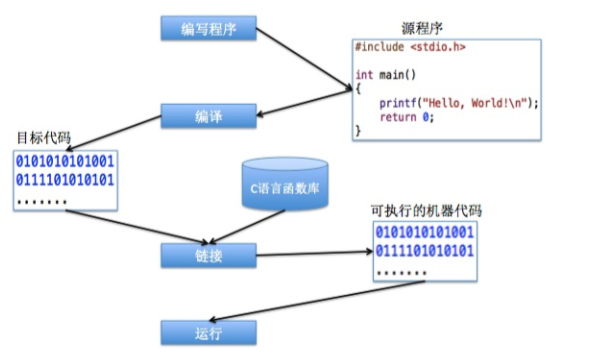

##### 程序语言的发展
	机器语言    汇编语言    高级语言
	1）机器语言 
		0和1组成
	2）汇编语言
		符号化的机器语言，用一个符号(单词、数据等)代表一条机器指令
		由于计算机只能识别二进制命令，所以需要翻译代码，这是“编译器”的重任啊。
		汇编语言是面向机器的，依赖于硬件，代码可移植性差。
	3）高级语言
		远离对硬件的直接操作，不需要对硬件很熟悉。
		简单，易用，易于理解，结构和文法类似于普通英文。
		可移植性好

	C语言是一门面向过程的语言，非面向对象的语言
	C语言可以直接操作硬件，还可以直接访问内存地址，适用于编写系统软件，图形处理，单片机程序，嵌入式系统开发甚至用于科研。
	C语言标准：ANSI C. (American National Standards Institute)

##### C程序执行
	先上张图片
	
	程序编译：编译器除了将.c源文件转为目标文件之外，还有一个非常重要的功能：语法检查
	程序链接：源文件编译成功后，会生成一个.o目标文件，这是一个二进制文件，但是还不能运行。
		原因：
		1）多个文件写的一个功能，编译后会生成多个.o目标文件，单独的.o文件都不能运行，需要将所有的相关的.o文件组合在一起
		2）除了组合所有的目标文件后，还需要将C语言的函数库包含进来，才能生成可执行文件
		在window中会生成一个.exe文件，在类unix系统中，生成一个.out文件
	
		使用gcc编译器时，可以指定生成的可执行文件名
			gcc -o executable_file source.c
	运行程序
		./a.out   a.out为可执行文件

##### 数据
	静态数据
		常见的是存储在磁盘上的文件，比如图片、文件和视频等
	动态数据
		当运行某个程序(软件)时，整个程序就会加载到内存中，在程序运行的过程中，会产生各种各样的临时数据，这些临时数据都是存储在你内存中的。
		当程序停止运行或者计算机被强制关闭时，这个程序产生的所有临时数据都会被清除。
	动态数据和静态数据的转换
		硬盘和内存时计算机使用最频繁的两个硬件，他们之间的数据经常需要进行转换
		比如一个苍老师.mp4和暴风影音，要使用暴风影音来播放。
		首先需要打开暴风影音软件，然后将暴风影音加载到内存中，紧接着计算机会读取硬盘中视频文件的内容到内存中，暴风影音进行解析，以视频的形式呈现给用户看。

		如果下载视频到本地，同样要加载暴风影音到内存中，然后从互联网上下载的数据加载到内存中，然后再放到磁盘上，完成了从动态数据到静态数据的转换。

	存储形式
		计算机只能识别0和1，文件视频等都是以这样方式存储的，这种方式称为二进制存储。

		一个字节有8个比特位，可以表示2^8个数据 1byte = 8 bit
		1Kb = 1024b; 1Mb = 1024Kb; 1Gb = 1024Mb; 1Tb = 1024Gb

	类型
		
		指针
		构造类型			数组 | 结构体(struct) | 共用体(union) | 枚举(enum)
		基本数据类型 		int float double char
		空类型			void
	变量
		定义： 在内存中分配一块存储空间给变量，方便以后存储数据	=> 类型 变量名
		初始化： 给变量赋值    => 变量名 = 值
		变量类型： 除了决定存储空间的大小之外，还用来约束存放的数据类型
		注意：变量不能重复定义。 int i =10; int i;//报错
	常量
		const int i = 10;

##### 进制
	十进制：	逢十进一 0-9 	
	二进制：	逢二进一 0-1	@以 0b 或者 0B开头； n位二进制数表示的最大值：2n-1
	八进制：	逢八进一 0-7	@以 0 开头 一位八进制可以由三位二进制数表示 0b11110011 = 0b+011+110+011 = 0363
	十六进制： 逢十六进一 0-9A-F @以 0x 开头，一位十六进制表示的范围是0-15共16中情况，是一位二进制的4倍，所以一位16进制可以用4位二进制表示

	printf() 支持的格式
		格式符		功能
		%d			带符号的十进制形式输出整数
		%o 			不带符号的八进制形式输出整数
		%x			不带符号的十六进制形式输出整数
		%u			不带符号的十进制形式输出整数
		%c 			输出一个字符
		%s			输出一个或多个字符
		%f			以小数形式输出单、双进度数，默认输出6位小数
		%e			以标准指数形式输出单、双进度数，数字部分小数位数是6位

##### 变量与内存
	字节和地址
		计算机中的内存是以【字节】为单位的存储空间。内存中的每一个字节都有一个唯一的编号，这个编号就称为地址。类似于酒店房间的房间号。
	
	变量存储
		变量不同类型占用的存储空间大小不一样，并且不同位[16/32/64位]的编译器分配的大小也是不一样的
		int b = 10; 和 char a= 'A' 的存储形式
		
		1）变量也有地址，存储单元的第一个字节的地址就是该变量的地址。变量a的地址是ffc5,变量b的地址是ffc1
		2）内存寻址是从大到小的，分配变量也是从内存地址较大的字节开始的。变量a先定义，所以地址更大一些
		3）变量b存储的内容时 ffc4 -> ffc3 -> ffc2 -> ffc1 拼接起来就是变量b的值了

		查看变量的内存地址
			printf("变量a的地址是%p\n", &a);  %p是专门用来输出地址的，&是取地址符的意思

	负数的二进制形式
		任何数值在内存中都是以补码的形式存储的。
		1）正数的补码与原码相同。比如9的补码和原码都是1001
		2）负数的补码等于它正数的原码取反后再+1
			以-10为例
			（1）10的二进制		00000000 00000000 00000000 00001010
			（2）对10的二进制取反	11111111 11111111 11111111 11110101
			（3）对取反的结果+1	11111111 11111111 11111111 11111110
	变量作用域
		变量作用的范围。如果是函数中定义的变量，函数调用时函数变量分配内存，赋值，运行结束后，释放该部分变量
		代码块{}中的变量也会在运行完变量块时释放
			int main(){
				int b; //变量b会在函数调用完毕后被销毁
				{
					int a = 10;
					printf("a=%d\n",a);
				}
				a = 9; //此处编译错误，因为代码块运行完后，变量a被销毁了
				return 0;
			}
		不同作用域中变量的名字可以相同，系统会给它们分配不同的空间
		变量没有赋值，不要使用，里面的数据是垃圾数据，绝对让你大跌眼镜

##### 基本数据类型
	变量的取值范围
		int 	4字节 	首位是符号位 表示范围是 -2^31 - 2^31-1
		char 	1字节 	-2^7 ~ 2^7
		float	4字节	3.4e^-38 ~ 3.4e^38, -3.4e^38 ~ -3.4e^-38
		double	8字节	1.7e^-308 ~ 1.7e^308, -1.7e^308 ~ -1.7e^-308

		数值越界 得到的结果不堪设想
		字符型变量不能存储汉字(一个汉字要两个字符...)

	ASCII(American Standard Code for Information Interchange).
		1)基于拉丁字母的一套编码系统。是一个字符集--字符的集合。包括了所有大小写字符，标点符号和一些特殊的控制字符，一共128个字符。
		2)ASCII在内存中是以二进制形式存储的，而且只占用1个字节。二进制的值，就是这个字符的ASCII的值。
		char c1 = 65;  //注意用char存储表示A的二进制数，也就是ASCII的值
		char c2 = 'A'; 
		printf("%c %c", c1,c2); // A A
		3)注意字符串的6和表示ASCII的值6是不同的
		char c2 = '6';
		char c1 = 6;
		printf("c1=%d c2=%d",c1,c2);

